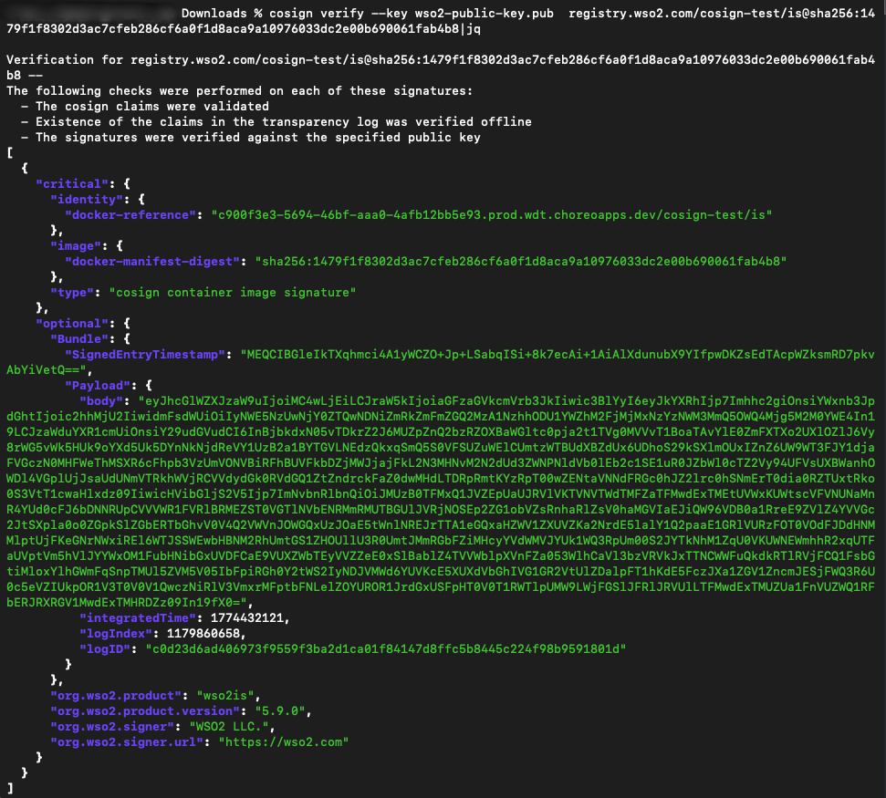

# Registry Image Verification

## Introduction

To ensure the security and authenticity of your deployments, WSO2 provides signed container images. This guide explains how to use the Cosign tool to verify that an image has not been tampered with and was officially released by WSO2.

## Prerequisites

Before verification, ensure:

* [Cosign](https://docs.sigstore.dev/cosign/system_config/installation/) is installed  
* Access to the [WSO2 container registry](https://registry.wso2.com)  
* Public key provided by WSO2

You need the WSO2 public key to validate the signatures. Save the following block into a file named **wso2-public-key.pub** on your local machine:

```shell
-----BEGIN PUBLIC KEY-----
MIIBIjANBgkqhkiG9w0BAQEFAAOCAQ8AMIIBCgKCAQEAw4rovhfVQqdUeXvtxxAl
3OKdNLNaUqiAlnb3zBxv7ITYCJXhXLByUk5wuKca6fr00d3NqwXoUeVARdrKMz5y
6a0QTLmM8CmD+l/ffGRqrNel23cdHkIi3wZFAJToHy+mFB6tYUoL6ieuEtLT+bFn
msBkucHBPp6ahicCVPfegiTWjSwBylnYSOPa9D/VmvQV13ROfuq1EgeejbCpepbc
9APj3pXjpFtOPWPBBYdofumqYj2sKR2y/V4yYl8mrEJon6SX3hBi5d0RXGNaFzdU
6D9rm4K6ZEEYX+l2uT+sHorTtI4e08KVOK7lU0VY4fiR+5Mh3FFKeLvF8KNMSYOZ
gQIDAQAB
-----END PUBLIC KEY-----
```

## Verify Your Image

### Run the Verification Command

The command you run depends on whether you are logged in to the WSO2 container registry. Use the following command structure to verify your image. Replace *\<image\_path\>* with the full registry path of the WSO2 image (e.g., `registry.wso2.com/wso2-am/am:v1.0.0`).

### A. If Already Logged In (Docker/OCI Client)

Verify the image directly:

```shell
cosign verify --key /path/to/wso2-public-key.pub <image_path>
```

### B. If Not Logged In

Pass credentials securely using environment variables:

1. Set credentials:

    ```shell
    export REGISTRY_USERNAME=<username>
    export REGISTRY_PASSWORD=<password>
    ```

2. Verify the image:

    ```shell
    cosign verify \
      --registry-username="$REGISTRY_USERNAME" \
      --registry-password="$REGISTRY_PASSWORD" \
      --key /path/to/wso2-public-key.pub \
      <image_url>
    ```

## Understanding the Results

When you run the command, a successful verification will display a message confirming that the **Cosign claims were validated** and the **signatures were verified** against the public key. If the verification fails, do not deploy the image and contact WSO2 support.

* Signature is valid  
* Image digest matches signed content


