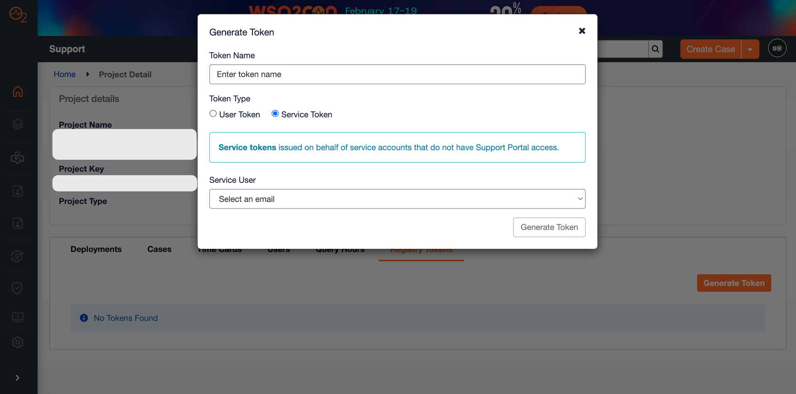
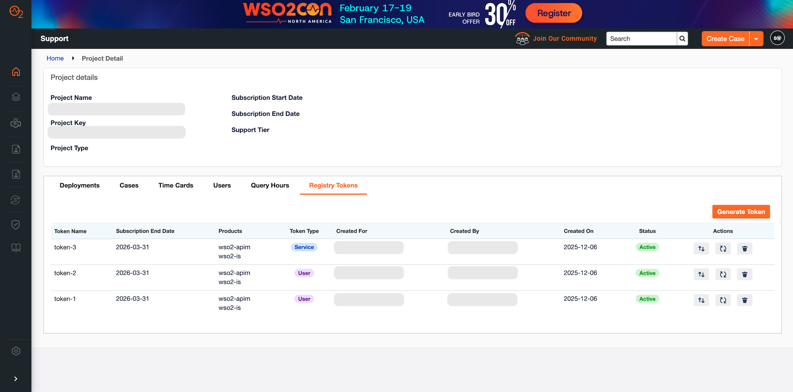

# Customer Admin Guide

In addition to all customer features, Customer Administrators can perform the following extra token management actions:

1. **Generate User Tokens** - This action is similar to the regular customer token generation. Created on behalf of the admin and used to access the WSO2 registry through the CLI.  
2. **Generate Service Tokens** - Created for service accounts that do not have Support Portal access.  
3. **View and Manage All Tokens** - Admins can view and manage any token created by any user within the project.

### **Generate User Token**

User tokens are generated on behalf of the creator and are intended for accessing WSO2 registry via the CLI.

To generate a new user token, follow these steps:

1. Click the **Generate Token** button.  
2. Enter a descriptive **Token Name**.  
3. Select the **User Token** option.  
4. Click the **Generate Token** button.

### **Generate Service Token**

Service tokens are issued on behalf of service accounts that do not have Support Portal access.

To generate a new service token, follow these steps:

1. Click the **Generate Token** button.  
2. Enter a descriptive **Token Name**.  
3. Select the **Service Token** option.  
4. Select a **Service User** from the dropdown.  
5. Click the **Generate Token** button.

### **View and Manage All Tokens**

Customer Admins can view and manage all tokens created within the project.  
Each token displays the following details:

* Token Name  
* Subscription End Date  
* Products associated with the token  
* Token Type  
* Created For  
* Created By  
* Created On  
* Token Status

Administrators can also perform the following actions on any token:

1. Re-sync Products  
2. Re-generate Secrets  
3. Delete tokens