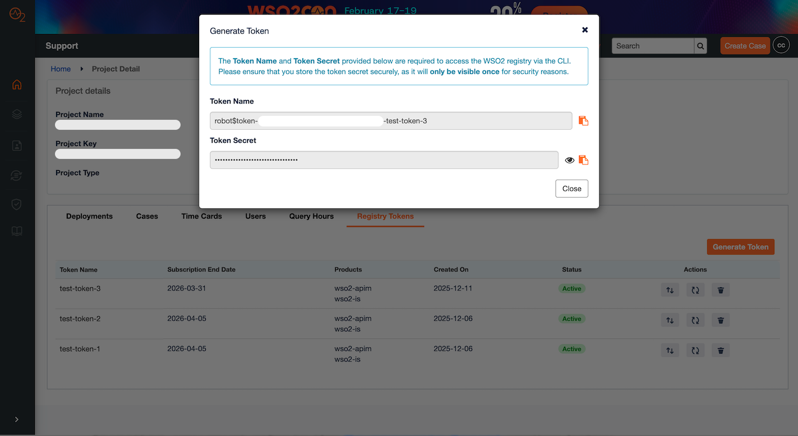
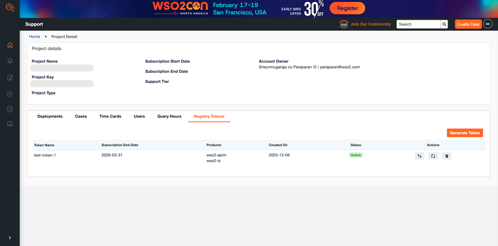
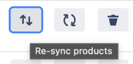
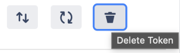

Customers can perform the following token management operations:

1. Generate Token  
2. View Tokens  
3. Re-sync Products  
4. Re-generate Secret  
5. Delete Token

### 1\. Generate Token

To generate a new token, follow these steps:

1. Click the **Generate Token** button.  
2. Enter a descriptive **Token Name**.  
3. Click the **Generate** **Token** button.

Upon successful generation, the system will display the **Token Name** and the **Token Secret**. This token is required to pull WSO2 product images from the [WSO2 registry](http://registry.wso2.com).

**Important Note:** The **Token Secret** is displayed only once. Please ensure you back up the secret before closing the window. If the secret is lost or forgotten, you must refer to the [**Re-generate Secret**](#4-re-generate-secret) section below.

### 2\. View Tokens

Customers can view a list of all their generated tokens. The displayed information includes:

* Token Name  
* Subscription End Date  
* Products associated with the token  
* Created On  
* Token Status

### 3\. Re-sync Products

Use the Re-sync Products action to update an existing token's permissions to include any new products you have recently subscribed to. Once this action is performed, the token will grant access to product images related to the new subscription.

### 4. Re-generate Secret {#4-re-generate-secret}

This action should be used if the existing token secret has been lost, forgotten, or compromised.

**Important Note:** Re-generating the secret will immediately invalidate the previous secret. Update all systems and applications using the old secret with the newly generated one.

### 5. Delete Token

If a token is no longer required, it can be deleted.

**Important Note:** Deletion is a permanent action and **cannot be undone**.
