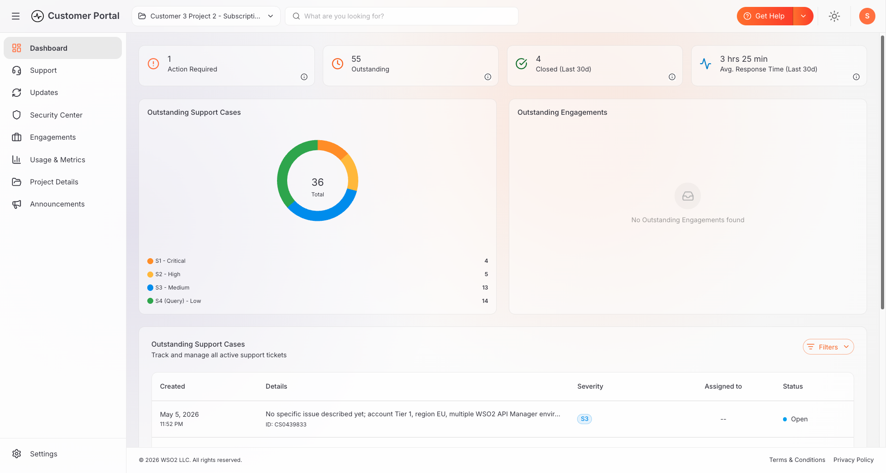
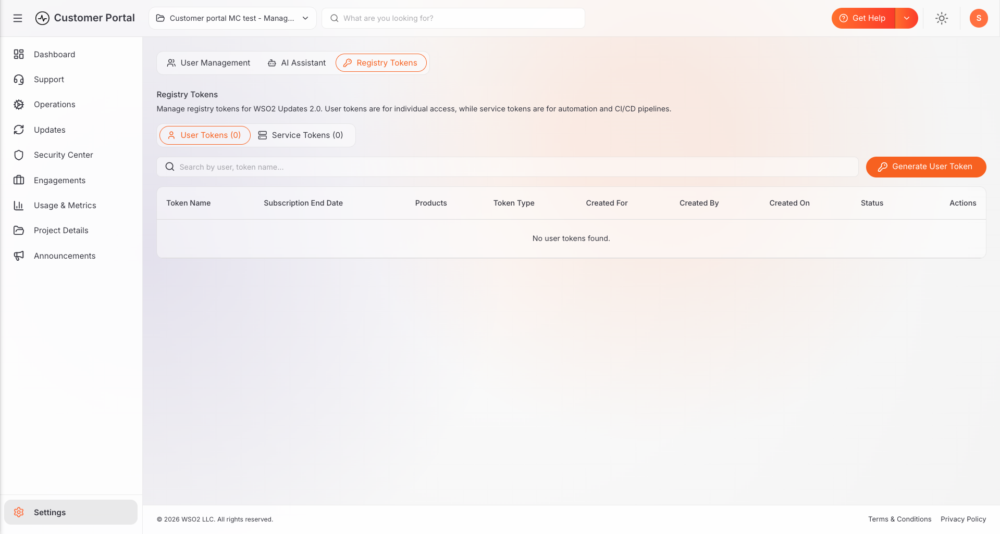

# Overview

This comprehensive guide is designed for WSO2 customers and their administrators, providing essential instructions on managing registry tokens within the WSO2 Support Portal to retrieve updated WSO2 product images via the Command Line Interface (CLI).

To access this feature, navigate to the [Settings](https://support.wso2.com/projects/f500381ec3bf3a10f21d330015013149/settings) page in the WSO2 Customer Portal, and then select the **Registry Tokens** tab.  

