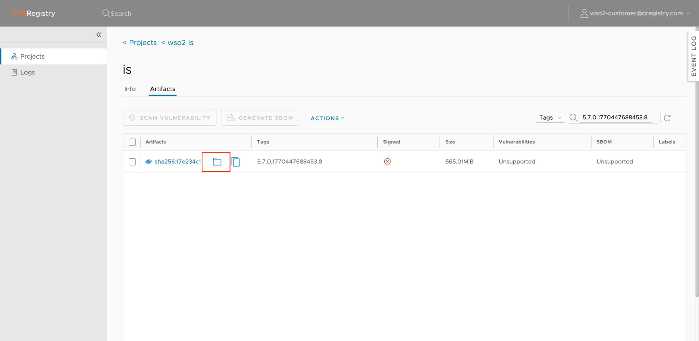
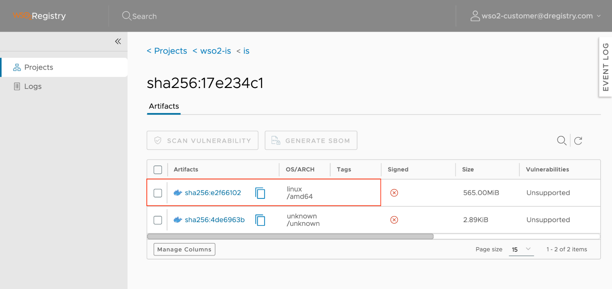

# FAQ

## **Q: I just purchased a new WSO2 product subscription. Why can't I pull the images?**

When a new subscription is added to your account, your existing **User Tokens or System Tokens** do not automatically receive permission for the new images. You must update them manually.

### Solution: Re-sync Products

1. Go to the **WSO2 Support Portal** \> **Registry Tokens**.  
2. Find your existing token in the list.  
3. Click the **Re-sync Products** (refresh icon) button.  
4. This updates the token's permissions to include any new products you have recently subscribed to.

## **Q: I lost my Token Secret. Can I recover it?**

No. For security reasons, the secret is displayed only once upon generation.

### Solution: Re-generate Secret

1. Go to the **WSO2 Support Portal** \> **Registry Tokens**.  
2. Select the **Re-generate Secret** option for the token.  
3. **Warning:** This will immediately invalidate the previous secret. You must update all pipelines or systems using the old secret.

## **Q: How do I remove access for an old server or employee?**

If a token is no longer required or if you believe it is compromised:

1. Go to the **Registry Tokens** page.  
2. Click the **Delete Token** (trash bin icon) button.  
3. This action is permanent and cannot be undone.

## **Q: Cannot pull images from my Arm64 based server/PC - "no matching manifest for linux/arm64/v8 in the manifest list entries"?**

When you try to pull a container image from an Arm-based server or personal computer (please refer to the section **Getting the Pull Command**), the system may throw the error *"no matching manifest for linux/arm64/v8 in the manifest list entries."* This occurs when the registry does not contain a matching architecture container image for the one requested by the client device. You can verify it by,

### Solution: Verify Available Architectures

You can verify the available architectures for an image by:

1. Click into a specific **Repository**.  
2. Locate the specific **Tag** (version) you wish to use (e.g., `5.7.0.1770447688453.8`).  
3. Click on the **folder icon** next to the **SHA** value.  

   
 You can then see the available OS architectures for the image.  

   

Since the image **doesn't** have any **arm64** architectural image, you are getting the error message.
