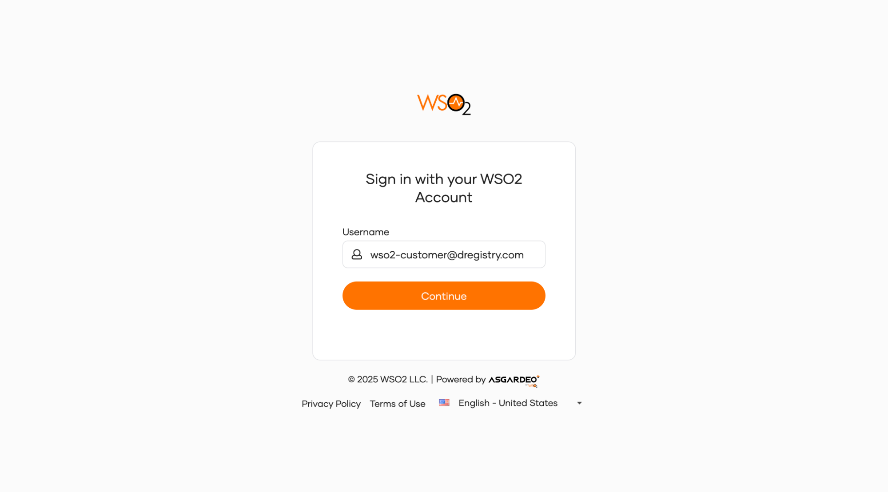
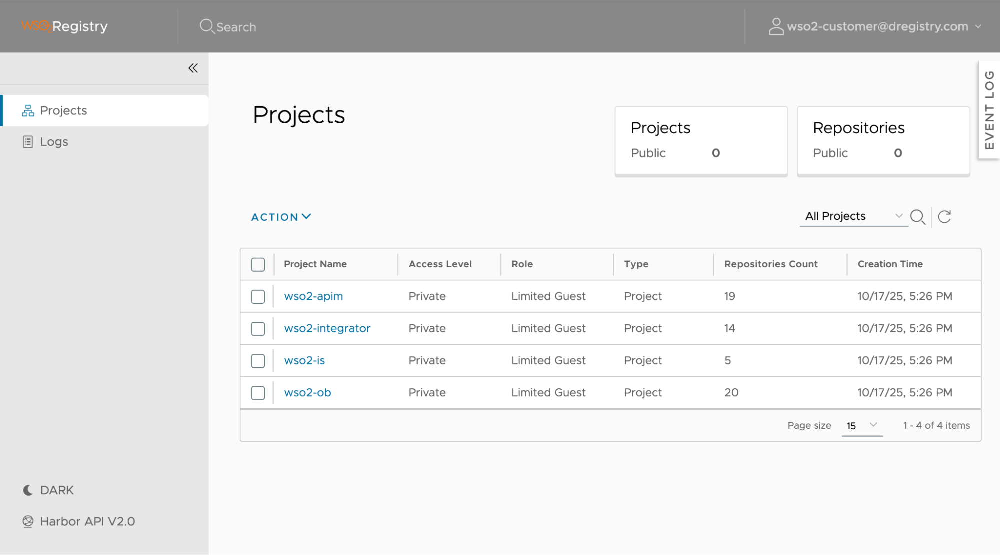
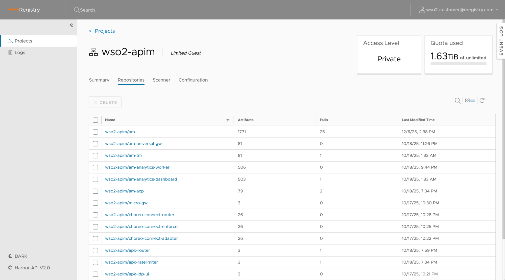
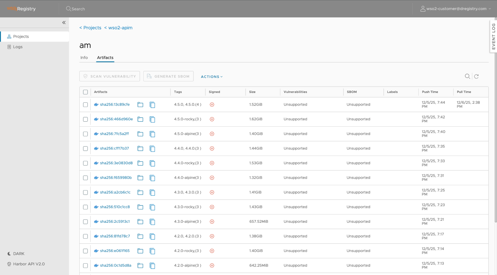
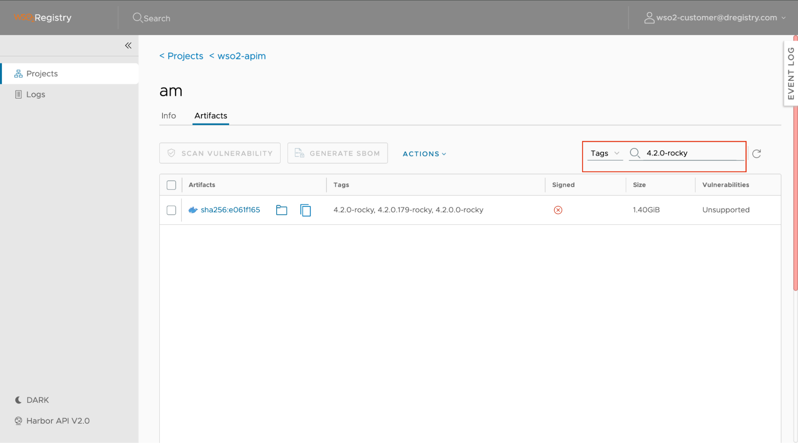
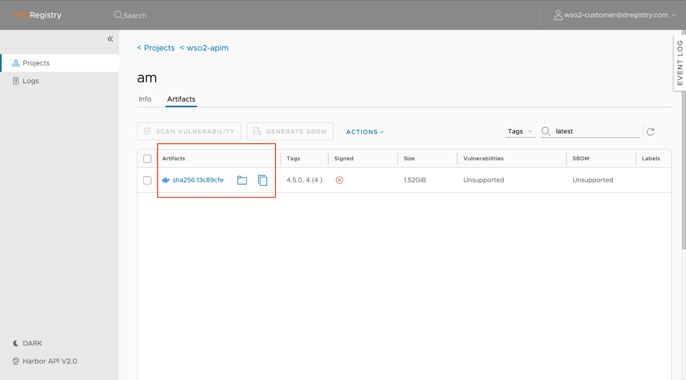
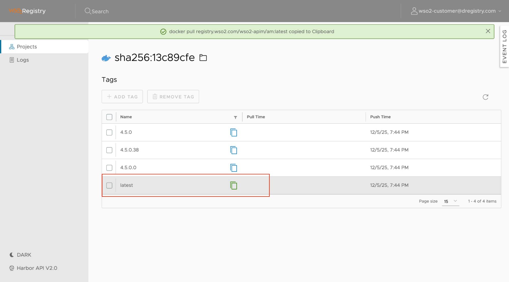

The web portal provides a visual interface to browse the projects and images you are entitled to.

### **1.1 Logging In**

1. Browse URL [**registry.wso2.com**](https://www.google.com/search?q=https://registry.wso2.com).  
2. Sign in using your standard **WSO2 Account Credentials** (the same email/password used for the Support Portal).

**Note** : If you are already logged in to your WSO2 account, that session will automatically authenticate you with the container registry. However, keep in mind that the user and system tokens generated from the WSO2 Support Portal are not valid for logging into the web portal.

### **1.2 Browsing Products and Projects**

Upon logging in, the view is filtered based on your active WSO2 product subscriptions. You will see projects associated with your account.

1. **Dashboard**: The main page displays a list of Projects. Each Project corresponds to a WSO2 Product (e.g., wso2-apim, wso2-is etc.).

    

2. **Select a Project:** Click on a project name to enter it.

3. **Repositories:** Inside the project, you will see a list of **Repositories**. 

    

4. **Tags:** Inside a Repository you can list down all the tags available.

    

### **1.3 Searching for an Image**

If you are looking for a specific version or component under a **Repository**:

1. Use the **Search Bar** at the top of the portal.  
2. Select the **Tags** as **Type.**  
3. Type the product name or tag (e.g., 4.2.0-rocky).  
4. The results will show matching repositories available under your subscription.

    

### **1.4 Getting the Pull Command**

To use an image, you need the exact "pull command" for your CLI.

1. Click into a specific **Repository**.  
2. Locate the specific **Tag** (version) you wish to use (e.g., latest or 4.2.0.15).  
3. Click the Artifact **SHA** value.

    

4. Select the Tag and click the Copy Icon next to the pull command.

    

e.g: docker pull registry.wso2.com/wso2-apim/am:latest